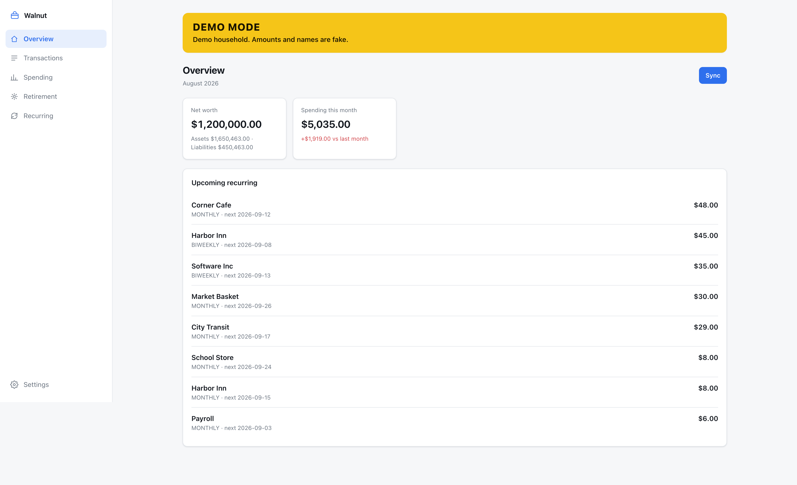
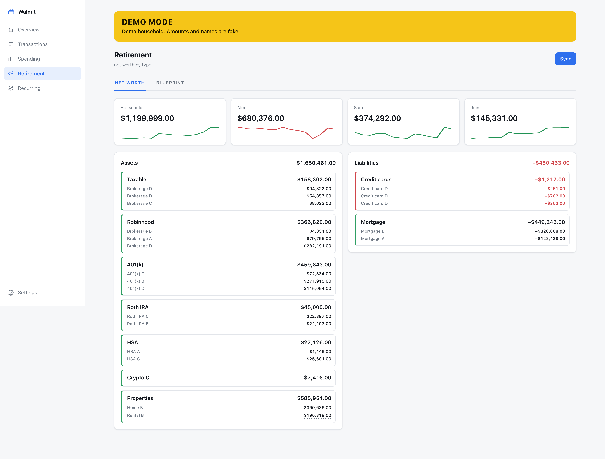
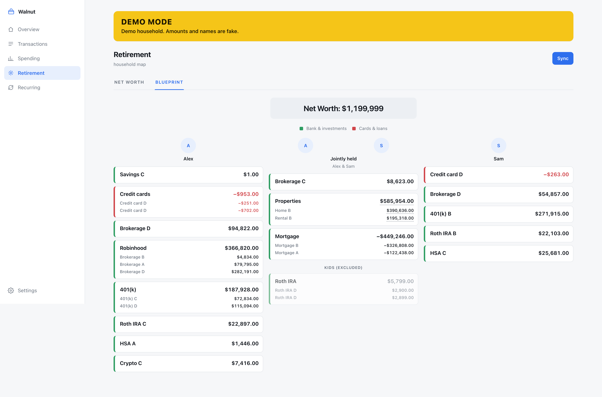
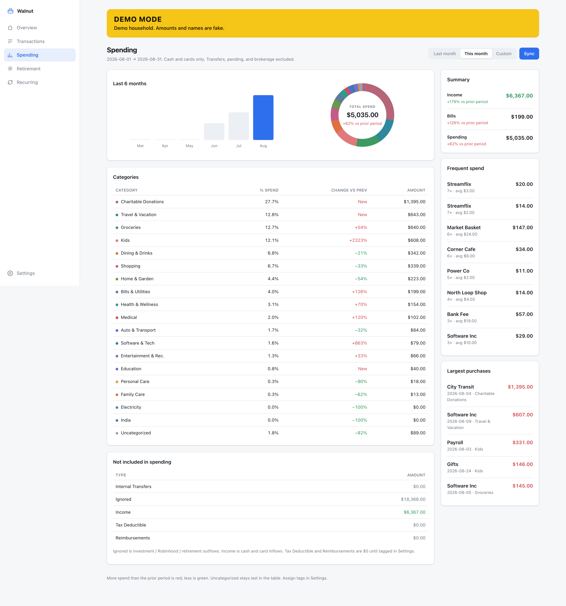
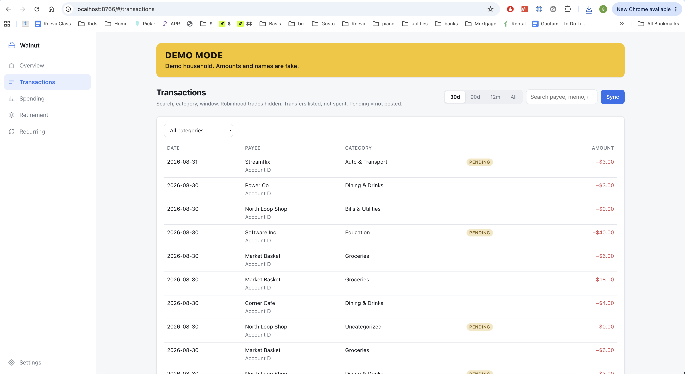
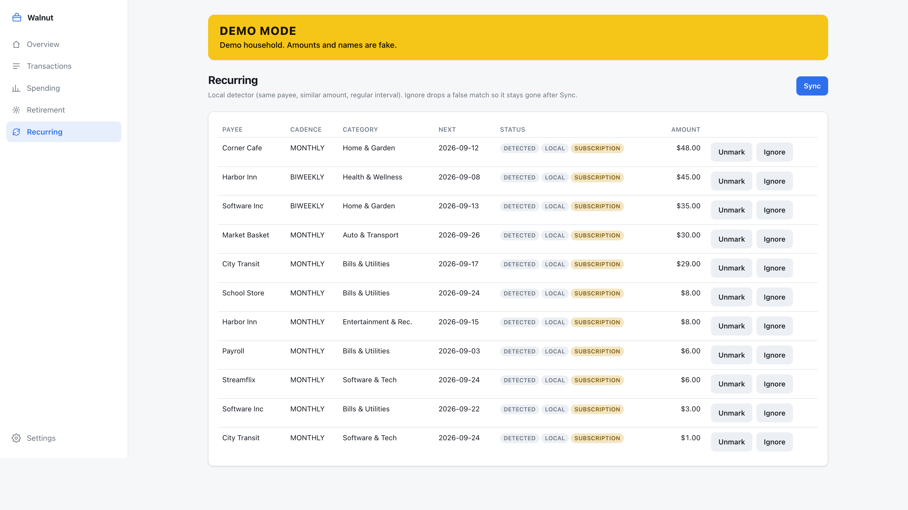
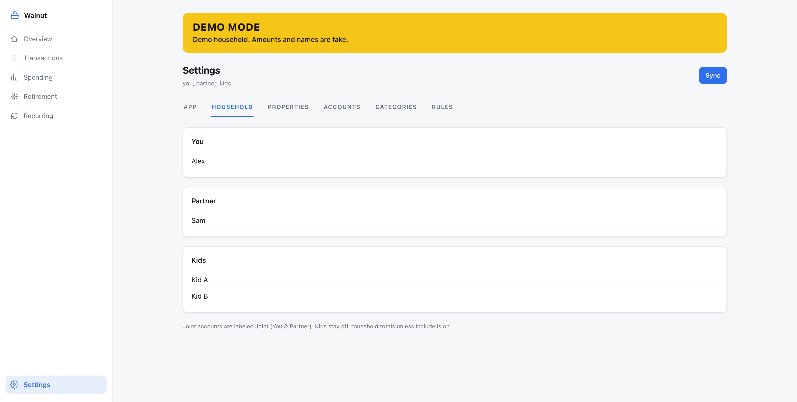

# Walnut

A local personal finance super app. Live bank source is
**[SimpleFIN Bridge](https://bridge.simplefin.org/)** (~$15/year, institutions via MX).
A setup token is claimed once in the UI. The Access URL stays in gitignored `.env`.

Binds **127.0.0.1:8766** by default and has **no authentication**. Do not expose
that port to the network.

## What it shows

- **Overview** — net worth, this-month spend vs last month, upcoming recurring
- **Transactions** — cash and cards. Pending rows are listed but not spend. Brokerage trades are hidden here (they still count toward net worth)
- **Spending** — this month / last month / custom range, 6-month bars, category donut, click a slice to recategorize
- **Retirement / Net worth** — household, per-person, assets vs liabilities, Blueprint map
- **Settings** — App (SimpleFIN token + Demo mode), Household (you, partner, kids), Accounts, Categories, Rules
- **Recurring** — local detector (same payee, similar amount, regular interval)

**Demo mode** (Settings → App) scales amounts and swaps names so you can screenshot
or show a friend without leaking the real household.

Python 3.12+, aiohttp, SQLite. No React, no bundler.

## Running Locally

You need Python 3.12 or newer.

```bash
cp .env.example .env
chmod 600 .env
python3 -m venv .venv
.venv/bin/pip install -e .
.venv/bin/walnut serve
```

With uv:

```bash
cp .env.example .env
chmod 600 .env
uv venv --python 3.12
uv pip install -e .
.venv/bin/walnut serve
```

Open [http://localhost:8766](http://localhost:8766). The process stays up even
without a SimpleFIN Access URL. The UI shows a setup banner until you connect.

Then [get a setup token](#getting-the-token) and paste it in the banner (or
Settings → App). Click **Connect**, then **Sync**. From a shell: `walnut sync`.

Env: `SIMPLEFIN_ACCESS_URL`, `WALNUT_WEB_HOST`, `WALNUT_WEB_PORT`, `WALNUT_DATA_DIR`.

| Command | What it does |
|---|---|
| `walnut serve` | Dashboard on 127.0.0.1:8766 |
| `walnut sync` | Pull SimpleFIN accounts + ~90 days of transactions |
| `walnut claim <setup-token>` | Claim a setup token (prints nothing secret). Prefer the UI. |

## Docker locally

Docker is the same app, published only on localhost. Inside the container it
listens on `0.0.0.0:8766`. Compose maps that to `127.0.0.1:8766` on your machine.
Do not change the publish address to `0.0.0.0` unless you have added your own
authentication.

```bash
cp .env.example .env
chmod 600 .env
mkdir -p data
docker compose up --build
```

Open [http://localhost:8766](http://localhost:8766), then
[get a setup token](#getting-the-token) and paste it in the UI.

`.env` and `data/` are mounted into the container so the claimed Access URL and
SQLite file survive restarts. They stay gitignored.

```bash
docker compose down
```

## Getting the Token

Walnut does not talk to your bank directly. [SimpleFIN Bridge](https://bridge.simplefin.org/)
does, for about $15/year. You buy a year, connect institutions there, then give
Walnut a one-time setup token.

1. Create an account at [bridge.simplefin.org](https://bridge.simplefin.org/).
2. Connect the banks, cards, and brokerages you want Walnut to see.
3. Open [Create a setup token](https://bridge.simplefin.org/simplefin/create).
4. Paste the token in Walnut (setup banner or Settings → App) and click **Connect**.
   The app claims it once and writes `SIMPLEFIN_ACCESS_URL` into gitignored `.env`
   (mode `0600`).
5. Click **Sync**. SimpleFIN typically returns about **90 days** of history. The UI
   labels that window **partial**.

A setup token is single-use. A 403 means it was already claimed or is invalid.
Revoke it on SimpleFIN and create a new one. Do not put setup tokens or Access
URLs in git, README, SQLite, logs, or chat. Never paste a token into `.env`
yourself. The UI is the claim path.

## Security

- Loopback bind (`127.0.0.1` on the host). No authentication.
- `.env` is gitignored, mode `0600`. **Never commit `SIMPLEFIN_ACCESS_URL` or a setup token.**
- `data/` is gitignored. `data/walnut.db` is mode `0600`.
- Every HTTP response is `Cache-Control: no-cache`.

## Amount convention

SimpleFIN amounts are **positive for money in**. Walnut stores integer cents
with **positive = money out**, **negative = money in**:

```
amount_cents = int(round(-float(amount) * 100))
```

Credit-card / loan balances from MX are usually **positive owed**. Walnut stores
`current_cents` negative for cards and loans so net worth still works. Asset
balances stay positive.

Spending totals are **posted cash/card outflows only**. Brokerage, IRA, and
crypto activity is listed (or hidden) but not spend.

## Screenshots

Demo mode. Amounts and names are fake.














